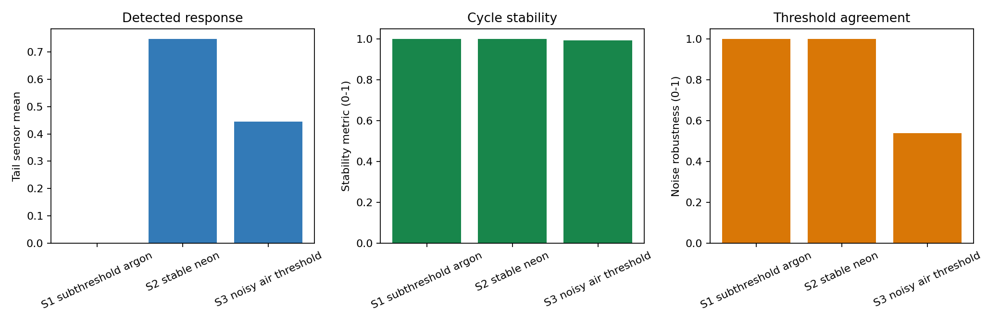
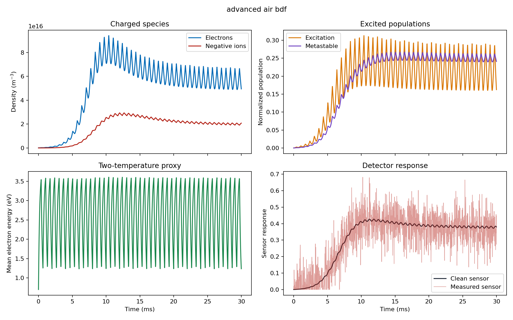
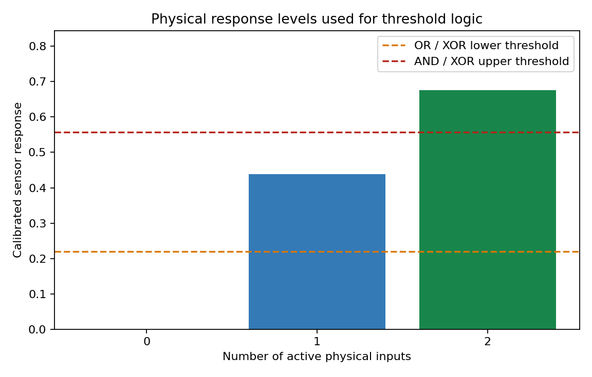
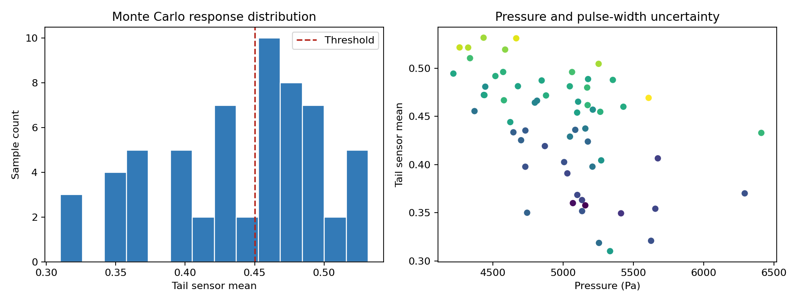
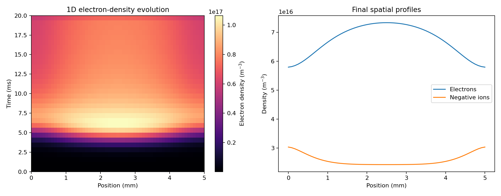

# Ionization-Based Logic System Simulation

[](https://www.python.org/)
[](LICENSE)
[](https://scientific-python.org/)

An educational Python simulation of a weakly ionized gas whose conductivity
and optical emission are converted into threshold-based digital logic.

The project combines simplified plasma kinetics, signal processing, adaptive
ODE integration, stochastic uncertainty analysis, and reaction-diffusion
modeling to explore a focused question:

> Can the physical response of a plasma-like system be digitized into stable
> AND, OR, XOR, NOT, NAND, NOR, half-adder, full-adder, and stateful logic
> behavior?

This is a conceptual scientific-computing project. It is not a nuclear
transmutation model, laboratory control system, high-voltage design guide, or
validated plasma chemistry package.

## Highlights

- Zero-dimensional mean-field plasma kinetics
- Ionization, recombination, excitation, and de-excitation
- Electron, positive-ion, negative-ion, and metastable populations
- Dynamic mean electron energy as a two-temperature proxy
- Conductivity and optical-emission sensor models
- Noisy threshold detection and stability metrics
- AND, OR, NOT, NAND, NOR, XOR, half-adder, and full-adder emulation
- Schmitt-trigger hysteresis and conceptual SR-latch memory
- Adaptive BDF, Radau, RK45, and LSODA integration
- Monte Carlo uncertainty propagation with confidence intervals
- CSV-ready coefficient calibration using nonlinear least squares
- One-dimensional reaction-diffusion simulation
- Reproducible seeds, CSV exports, plots, and automated tests

## Simulation Gallery

### Scenario comparison



### Advanced air model

The extended model tracks electron attachment, negative-ion accumulation,
metastable populations, and time-varying mean electron energy.



### Threshold logic levels



### Monte Carlo uncertainty



### One-dimensional reaction-diffusion



## Model Overview

The neutral number density is estimated from the ideal-gas relation:

```text
N = p / (k_B T)
```

The electric-field input and the voltage-derived field are blended before the
reduced field is evaluated:

```text
E_0 = (1 - b) E_input + b (V / d)
(E/N)_Td = E_0 / (N x 10^-21)
```

Ionization activation is represented by a smooth threshold:

```text
A(E/N) = 1 / (1 + exp(-((E/N) - E_threshold) / width))
```

The basic normalized charged-particle balance is:

```text
dx_e/dt = R_ion - R_rec - k_e,loss x_e
dx_i/dt = R_ion - R_rec - k_i,loss x_i
```

The advanced model adds:

```text
electron attachment and detachment
positive-ion / negative-ion neutralization
metastable-assisted stepwise ionization
mean electron-energy relaxation
species-dependent diffusion
```

Conductivity and optical emission are converted to saturating sensor channels,
filtered by a finite detector time constant, contaminated with reproducible
Gaussian noise, and digitized using either a single threshold or hysteresis.

The complete assumptions, equations, coefficients, and interpretations are in
the [Turkish technical report](MODEL_RAPORU.md).

## Logic Emulation

The simulation does not draw conventional electronic gates. Instead, zero,
one, two, or three active physical inputs create calibrated analog sensor
levels. Thresholds or response windows convert those levels into logic states.

| A | B | AND | OR | XOR | Half-adder sum | Carry |
|---:|---:|---:|---:|---:|---:|---:|
| 0 | 0 | 0 | 0 | 0 | 0 | 0 |
| 0 | 1 | 0 | 1 | 1 | 1 | 0 |
| 1 | 0 | 0 | 1 | 1 | 1 | 0 |
| 1 | 1 | 1 | 1 | 0 | 0 | 1 |

The full adder classifies four calibrated physical-response levels and returns
the parity bit as `SUM` and the two-or-more classification as `CARRY_OUT`.

## Included Scenarios

| Scenario | Gas | Physical interpretation |
|---|---|---|
| Subthreshold argon | Argon | Ionization cannot overcome effective losses |
| Stable neon | Neon | Strong, repeatable high sensor response |
| Noisy threshold air | Air | Stable physical cycle but noise-sensitive digital decision |

Representative results:

| Scenario | Tail sensor mean | Binary output | Stability | Noise robustness |
|---|---:|---:|---:|---:|
| Subthreshold argon | 0.000234 | 0 | 0.9996 | 1.0000 |
| Stable neon | 0.747291 | 1 | 0.9993 | 1.0000 |
| Noisy threshold air | 0.445599 | 0 | 0.9931 | 0.5399 |

## Installation

Requirements:

- Python 3.10 or newer
- NumPy
- Pandas
- Matplotlib
- SciPy

```bash
git clone https://github.com/AybarsBarut/Ionization-Based-Logic-System-Simulation.git
cd Ionization-Based-Logic-System-Simulation
python -m venv .venv
```

Activate the virtual environment:

```bash
# Windows PowerShell
.\.venv\Scripts\Activate.ps1

# Linux or macOS
source .venv/bin/activate
```

Install the project:

```bash
python -m pip install --upgrade pip
python -m pip install -e .
```

## Quick Start

Run every scenario, logic table, parameter sweep, uncertainty analysis,
calibration example, and spatial simulation:

```bash
python run_experiments.py --output-dir outputs
```

After editable installation, the equivalent command is:

```bash
plasma-logic-sim --output-dir outputs
```

Run the automated tests:

```bash
python -m unittest -v
```

## Python API Example

```python
from plasma_model import PlasmaConfig, simulate_plasma

config = PlasmaConfig(
    gas="argon",
    pressure_pa=4_000.0,
    temperature_k=300.0,
    electric_field_v_m=175_000.0,
    applied_voltage_v=875.0,
    pulse_frequency_hz=2_000.0,
    pulse_width_s=2.0e-4,
    measurement_noise_std=0.025,
    random_seed=2026,
)

result = simulate_plasma(config)

print(result.summary)
print(result.data.head())
```

Advanced adaptive integration:

```python
from advanced_models import AdvancedModelOptions, simulate_advanced_plasma

result = simulate_advanced_plasma(
    config,
    options=AdvancedModelOptions(solver_method="BDF"),
)

print(result.data[
    [
        "electron_density_m3",
        "negative_ion_density_m3",
        "metastable_fraction",
        "electron_energy_ev",
    ]
].tail())
```

## Generated Data

The experiment runner writes reproducible CSV, PNG, and text artifacts,
including:

- Time-series plasma states
- Scenario summaries
- Logic truth tables
- Full-adder calibration levels
- Threshold and field-pressure sweeps
- Parameter sensitivities
- Adaptive-solver comparisons
- Monte Carlo samples and confidence summaries
- Coefficient-calibration diagnostics
- Schmitt-trigger and latch sequences
- One-dimensional spatial snapshots

Generated artifacts are intentionally excluded from Git because they can be
recreated with one command. Selected figures are versioned in `docs/images`.

## Project Structure

```text
.
|-- plasma_model.py          # Base kinetics, metrics, and logic emulation
|-- advanced_models.py       # Adaptive ODE, uncertainty, fitting, and 1D model
|-- run_experiments.py       # Reproducible experiment and plotting pipeline
|-- test_plasma_model.py     # Automated regression and physics sanity tests
|-- MODEL_RAPORU.md          # Detailed Turkish equations and interpretation
|-- docs/images/             # Selected versioned result figures
|-- requirements.txt
`-- pyproject.toml
```

## Reproducibility

- The default random seed is fixed.
- Input parameters are stored in dataclasses.
- All generated tables use explicit column names and SI units.
- Solver comparisons are exported to CSV.
- Sixteen automated tests cover state bounds, logic behavior, adaptive
  solvers, calibration, uncertainty propagation, and spatial diffusion.

## Important Limitations

- Coefficients are effective educational parameters, not validated reaction
  cross sections.
- The model is not suitable for laboratory safety decisions or device control.
- The one-dimensional model does not solve Poisson's equation or electrode
  sheath dynamics.
- Air chemistry is represented by aggregate effective species.
- Optical emission is relative rather than radiometrically calibrated.
- The included coefficient-fitting example uses synthetic observations.

## Documentation

- [Detailed model report in Turkish](MODEL_RAPORU.md)
- [Contributing guide](CONTRIBUTING.md)
- [Security and safe-use policy](SECURITY.md)
- [Citation metadata](CITATION.cff)

## Citation

If this educational simulator supports a report, course, or prototype, cite it
using the metadata in [`CITATION.cff`](CITATION.cff).

## Contributing

Issues and pull requests are welcome. Please keep proposed physics extensions
clearly labeled as conceptual, empirical, or experimentally calibrated. See
[CONTRIBUTING.md](CONTRIBUTING.md) before submitting changes.

## License

Released under the [MIT License](LICENSE).

## Search Topics

Plasma simulation, ionization modeling, threshold logic, plasma logic gates,
scientific Python, reaction-diffusion, adaptive ODE solvers, signal processing,
Monte Carlo uncertainty, conductivity modeling, optical emission, and
educational computational physics.
